## 목차

[1. 프로젝트 소개](#1)

[2. 서비스 화면](#2)

[3. 프로젝트 산출물(ERD, 시퀀스, 피그마 등)](#3)

[4. 팀원 소개](#4)

<div id="1"></div>

# 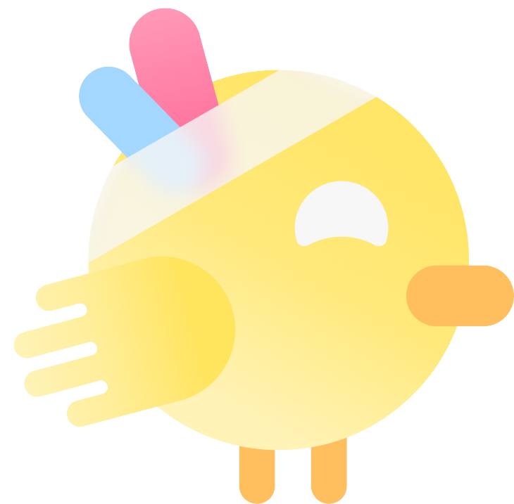 프로젝트 소개

###  HiFive - 크리에이터와 팬의 하이파이브


크리에이터와 팬이 추억을 마주하는 웹기반 팬미팅 플랫폼

<br >

### 1. 로고 및 캐릭터


- 크리에이터와 팬이 손뼉을 마주하는 장면을 형상화
  - Primary : <span style="background-color: #FF6392; color: white;">#FF6392</span>
  - Secondary : <span style="background-color: #4FB2FF; color: white;">#4FB2FF</span>
- 서비스 이용자를 크리에이터와 팬으로 분리하여 고려
- 크리에이터만 접속 가능한 팬미팅 관리 페이지는 <span style="background-color: #4FB2FF; color: white;">Secondary</span> 로 표현하여 사용자가 관리 페이지임을 명확히 인식할 수 있도록 함

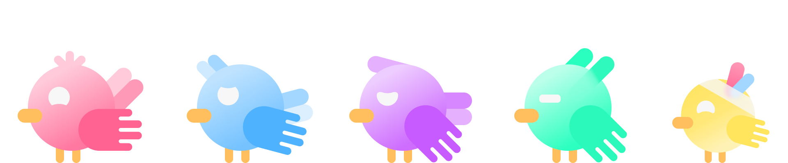

- 로고를 구성하는 요소의 형태에서 새의 날개를 떠올려 이를 기반으로 캐릭터 형태 구상
- 팬들의 다양한 성향과 성격을 나타내기 위해 총 5종류의 캐릭터 제작

### 2. 서비스 목적

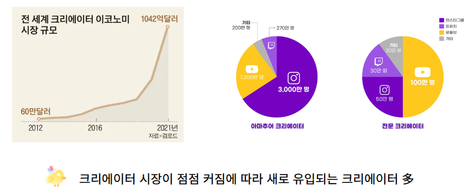

- 크리에이터 시장 규모가 급증했음에도 크리에이터와 팬을 위한 소통의 창구가 부족함
- 버츄얼 유튜버, 해외에 거주하는 유튜버 등 대면 팬미팅이 어려운 크리에이터도 팬과 소통을 즐길 수 있도록 함

### 3. 차별점

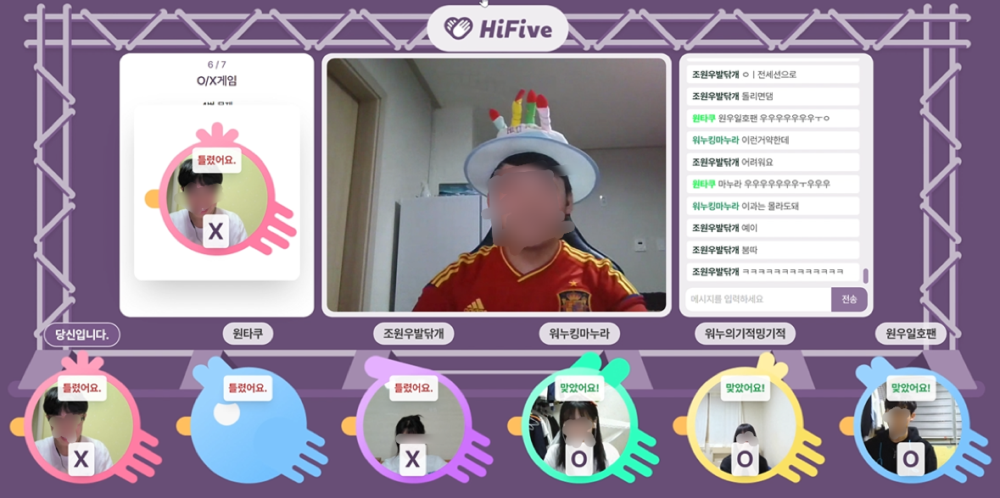

- 다양한 팬미팅 템플릿을 제공하여 간편하게 팬과의 특별한 추억을 남길 수 있음
  - **O/X 게임, Q&A, 사연 전달, 포토 타임 등 다양한 코너 템플릿 제공**
- 오프라인으로 진행하기 어려운 크리에이터를 위한 온라인 플랫폼 제공
- 소속사가 없는 영세 크리에이터도 쉽게 이용 가능
- 입장 전 **본인 확인 절차**를 통해 티켓 암표 거래 방지

### 4. 아키텍처

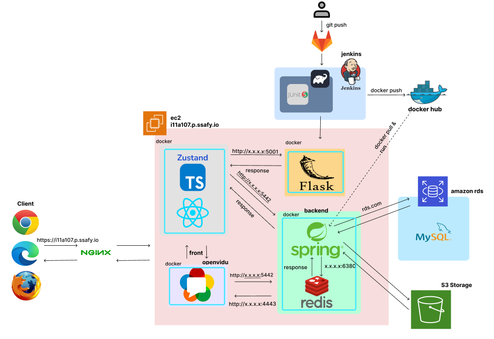

### 5. 기술스택

[](https://github.com/msdio/stackticon)

### 6. UCC

<iframe width="956" height="538" src="https://www.youtube.com/embed/25wbb9hVTLo" frameborder="0" allow="accelerometer; autoplay; encrypted-media; gyroscope; picture-in-picture" allowfullscreen></iframe>

<div id="2"></div>

#  서비스 화면

#### 1. 공통 화면

|                                                               |                                                         |
| ------------------------------------------------------------- | ------------------------------------------------------- |
|          |    |
| ✨ 랜딩화면(서비스 소개 페이지)                               | 📌 메인화면                                             |
|            |  |
| 🔑 카카오 로그인                                              | 🔍 프로필검색                                           |
|              |    |
| 💚 크리에이터 프로필 조회                                     | 👶 마이페이지                                           |
|  |      |
| 📖 사연, 질문 작성                                            | 👱‍♀️ 본인 확인                                            |
| 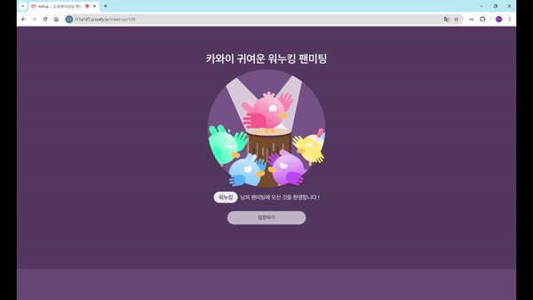             |              |
| 🚪 팬미팅 입장                                                | 👂 소통 세션                                            |
|                |            |
| 👨‍👩‍👧‍👦 포토타임 세션                                              | 🎮 OX게임 세션                                          |
|                    |              |
| 🎶 공연 세션                                                  | 💌 사연 세션                                            |
|                     | 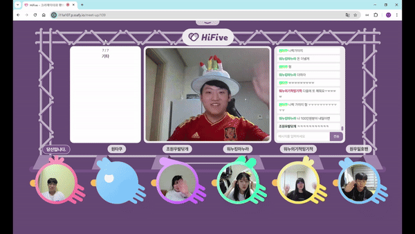             |
| ❓ QnA 세션                                                   | 💛 엔딩                                                 |

#### 2. 크리에이터 화면

|                                                                 |                                                               |
| --------------------------------------------------------------- | ------------------------------------------------------------- |
|  |  |
| 📚 [크리에이터] 사연, 질문, OX게임 관리                         | 🔊 [크리에이터] 크리에이터 프로필 작성, 수정, 삭제            |
|        |                                                               |
| 🎪 [크리에이터] 팬미팅 진행                                     |                                                               |

<br/>

<div id="3"></div>

# 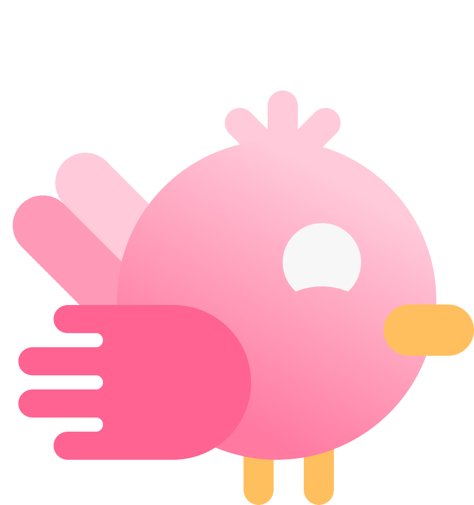 프로젝트 산출물

|                                                       |                                                           |
| ----------------------------------------------------- | --------------------------------------------------------- |
| 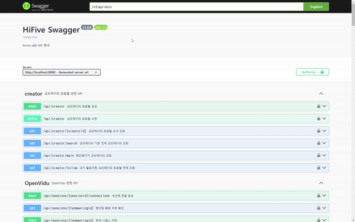      | 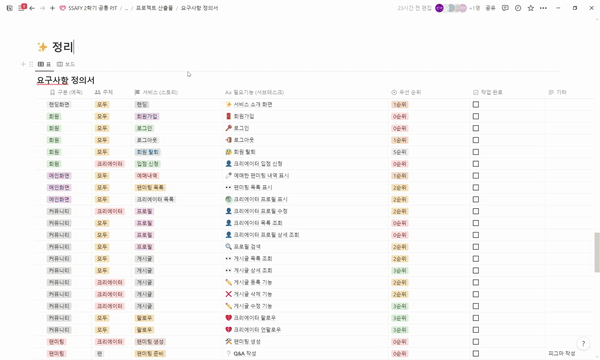     |
| 📃 API 명세서(Swagger)                                | 🌞 요구사항정의서                                         |
| 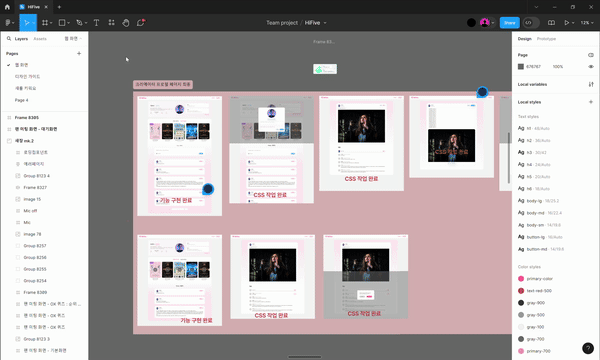         | 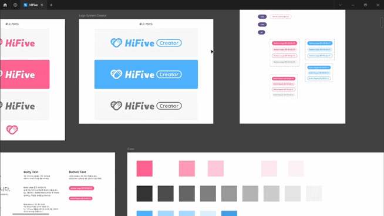 |
| 🎨 피그마                                             | 🎨 피그마 - 디자인 가이드                                 |
| 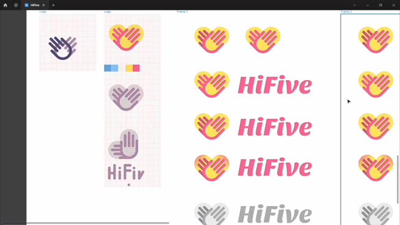 | 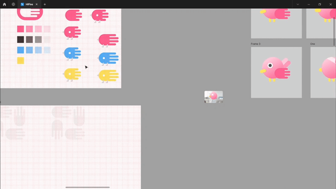       |
| 🎨 피그마 - 로고 디자인                               | 🎨 피그마 - 캐릭터 디자인                                 |

### 🔧 ERD

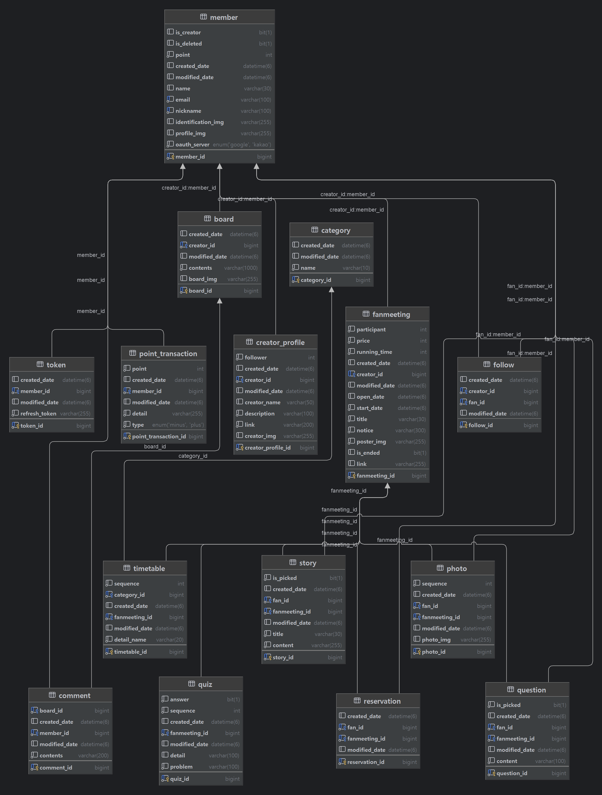

### 📱 시퀀스 다이어그램

#### 1. 티켓팅 시퀀스

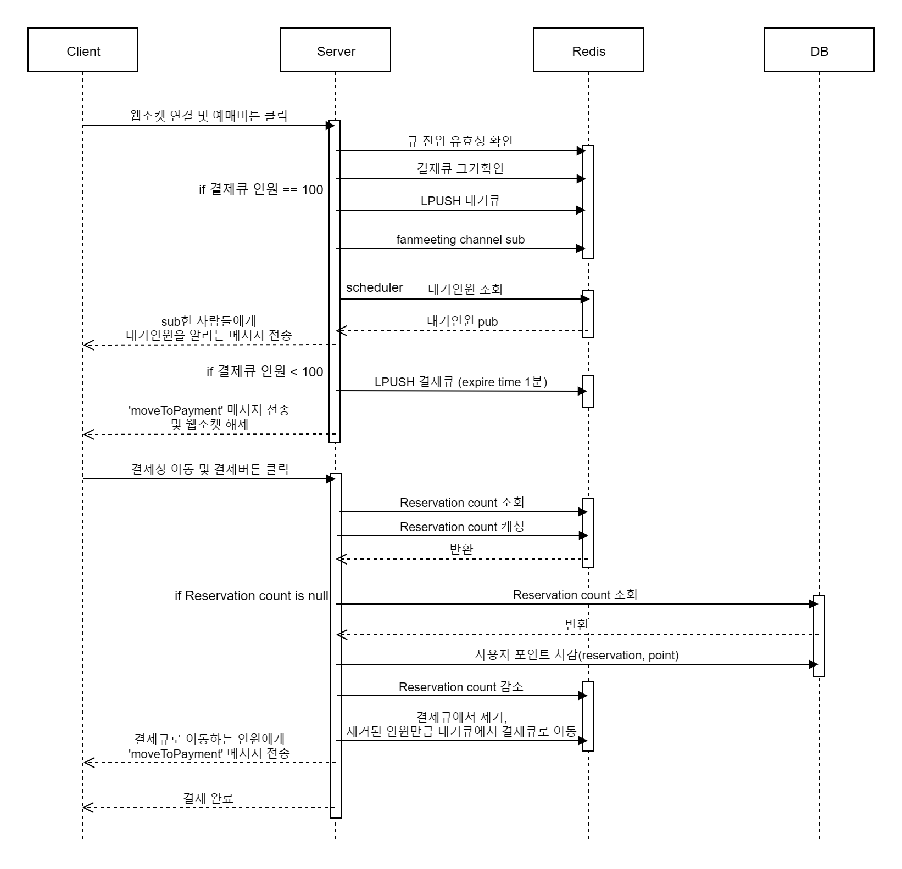

##### 로직 설명

<details>
  <summary>펼치기 / 접기</summary>
  
  ### Redis Pub/Sub, WebSocket, 그리고 스케줄러

- **WebSocket 연결**: 사용자가 예매하기 버튼을 클릭하면 WebSocket 연결이 설정됩니다.
- **API 요청**: `reservation/{fanmeetingId}` API 요청을 통해 팬미팅 및 사용자 결제 유효성을 검증한 후, 사용자는 대기 큐(waiting-queue) 또는 결제 큐(paying-queue)에 담기게 됩니다.

### 1. **대기 큐에 있을 때**

- **채널 구독**: 사용자는 자신이 결제하고자 하는 팬미팅 채널을 구독합니다.
- **스케줄러**: 10초마다 현재 대기 인원을 알리는 메시지를 발행합니다.
- **큐 이동**: 결제 큐에 자리가 생기면 대기 큐에서 결제 큐로 사용자가 이동합니다.

### 2. **결제 큐에 있을 때**

- **결제로 이동**: 서버에서 WebSocket 메시지를 통해 사용자를 결제 페이지로 이동시키라는 메시지를 전송합니다.
- **결제 처리**:
  - 사용자의 WebSocket 연결이 해제되고 결제 페이지로 이동합니다.
  - 결제 세션은 5분 후 만료됩니다.
  - `reservation/{fanmeetingId}/payment` API 요청을 통해 세션 만료 여부, 남은 티켓 수, 사용자 포인트를 확인한 후 결제가 진행됩니다.
  - 결제가 완료되면 사용자는 결제 큐에서 제거됩니다.

### **스케줄러**

- **checkExpiredPayments**: 3분마다 결제 큐에서 만료된 사용자를 제거하고, 대기 큐에서 그만큼의 사용자를 결제 큐로 이동시킵니다.
- **checkWaiting**: 대기 큐에 사용자가 있으면 10초마다 대기 인원을 알리는 메시지를 발행합니다.

### **Redis**

- **remainingTicket**: 30분 동안 캐시되며, 만료 시 DB에서 데이터를 가져옵니다.
- **paying-queue**: 유효시간 5분, 최대 100명의 사용자가 결제 페이지에 접근할 수 있습니다.
- **waiting-queue**: 유효시간 1시간, 결제 큐로 이동하기 위해 대기하는 사용자들이 모여 있습니다.

### **WebSocket**

- 팬미팅 채널을 구독한 사용자에게 대기 인원 업데이트 메시지(`currentQueueSize`, `fanmeeting:*`)를 전송합니다.
- 사용자가 결제 큐에 진입할 때 `moveToPayment` 메시지를 전송합니다.

</details>

#### 2. OX게임 시퀀스

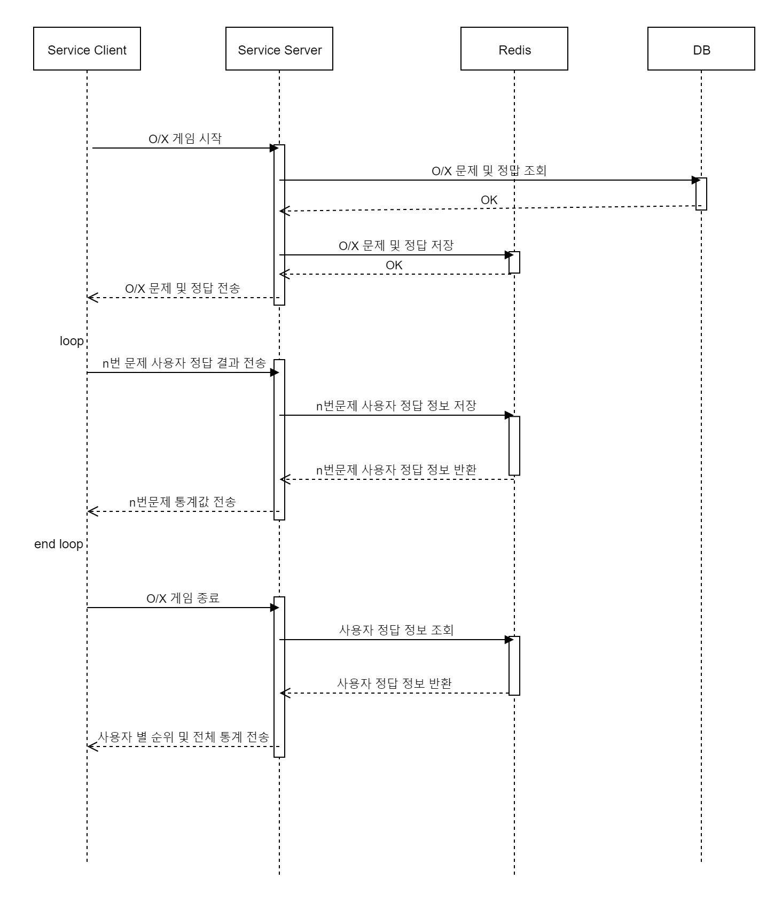

##### 로직 설명

<details>
  <summary>펼치기 / 접기</summary>

### OX 게임 로직 설명

- **OX 게임 시작**: 사용자가 OX 게임을 시작하면, 서버는 Redis에서 OX 문제와 정답 정보를 조회하여 클라이언트에게 전송합니다.

### 반복 루프: 각 문제 처리 과정

- **OX 문제 전송**: 서버는 현재 문제의 정보를 클라이언트에게 전송합니다.
- **사용자 정답 제출 및 저장**: 사용자가 문제에 대한 정답을 제출하면, 서버는 해당 정답을 Redis에 저장합니다. 정답이 맞다면, Redis의 Sorted Set에 사용자의 점수를 1점 증가시킵니다.
- **결과 반환**: 서버는 Redis에서 현재 문제에 대한 사용자들의 정답 결과를 조회하여 클라이언트에 반환합니다.

### 루프 종료: OX 게임 종료 후

- **OX 게임 종료**: 모든 문제가 끝나면, 서버는 Redis에서 사용자들의 최종 점수와 순위 정보를 조회합니다.
- **결과 전송**: 최종 결과를 클라이언트에게 전송하여, 사용자들에게 순위 및 통계 정보를 보여줍니다.

### **Redis 구조**

- **OX 문제 및 정답 정보 저장**: Redis에 특정 팬미팅 ID와 관련된 OX 문제와 정답 정보가 저장됩니다.
- **사용자 정답 및 점수 저장**: 각 문제에 대한 사용자들의 정답 정보가 Redis에 저장되며, 사용자의 점수는 Redis의 Sorted Set으로 관리됩니다.
- **순위 조회 및 통계**: 사용자의 점수를 기반으로 순위가 정해지고, 이를 통해 최종 순위 및 통계 정보를 제공합니다.

</details>

### 📂 프로젝트 구조

#### Backend

<details>
  <summary>펼치기 / 접기</summary>

```
📦main
 ┣ 📂java
 ┃ ┗ 📂com
 ┃ ┃ ┗ 📂ssafy
 ┃ ┃ ┃ ┗ 📂hifive
 ┃ ┃ ┃ ┃ ┣ 📂domain
 ┃ ┃ ┃ ┃ ┃ ┣ 📂auth
 ┃ ┃ ┃ ┃ ┃ ┃ ┣ 📂controller
 ┃ ┃ ┃ ┃ ┃ ┃ ┣ 📂dto
 ┃ ┃ ┃ ┃ ┃ ┃ ┃ ┣ 📂response
 ┃ ┃ ┃ ┃ ┃ ┃ ┣ 📂entity
 ┃ ┃ ┃ ┃ ┃ ┃ ┣ 📂repository
 ┃ ┃ ┃ ┃ ┃ ┃ ┗ 📂service
 ┃ ┃ ┃ ┃ ┃ ┣ 📂board
 ┃ ┃ ┃ ┃ ┃ ┃ ┣ 📂controller
 ┃ ┃ ┃ ┃ ┃ ┃ ┣ 📂dto
 ┃ ┃ ┃ ┃ ┃ ┃ ┃ ┣ 📂param
 ┃ ┃ ┃ ┃ ┃ ┃ ┃ ┣ 📂request
 ┃ ┃ ┃ ┃ ┃ ┃ ┃ ┗ 📂response
 ┃ ┃ ┃ ┃ ┃ ┃ ┣ 📂entity
 ┃ ┃ ┃ ┃ ┃ ┃ ┣ 📂repository
 ┃ ┃ ┃ ┃ ┃ ┃ ┗ 📂service
 ┃ ┃ ┃ ┃ ┃ ┣ 📂category
 ┃ ┃ ┃ ┃ ┃ ┃ ┣ 📂controller
 ┃ ┃ ┃ ┃ ┃ ┃ ┣ 📂dto
 ┃ ┃ ┃ ┃ ┃ ┃ ┃ ┗ 📂response
 ┃ ┃ ┃ ┃ ┃ ┃ ┣ 📂entity
 ┃ ┃ ┃ ┃ ┃ ┃ ┣ 📂repository
 ┃ ┃ ┃ ┃ ┃ ┃ ┗ 📂service
 ┃ ┃ ┃ ┃ ┃ ┣ 📂comment
 ┃ ┃ ┃ ┃ ┃ ┃ ┣ 📂controller
 ┃ ┃ ┃ ┃ ┃ ┃ ┣ 📂dto
 ┃ ┃ ┃ ┃ ┃ ┃ ┃ ┣ 📂param
 ┃ ┃ ┃ ┃ ┃ ┃ ┃ ┣ 📂request
 ┃ ┃ ┃ ┃ ┃ ┃ ┃ ┗ 📂response
 ┃ ┃ ┃ ┃ ┃ ┃ ┣ 📂entity
 ┃ ┃ ┃ ┃ ┃ ┃ ┣ 📂repository
 ┃ ┃ ┃ ┃ ┃ ┃ ┗ 📂service
 ┃ ┃ ┃ ┃ ┃ ┣ 📂creator
 ┃ ┃ ┃ ┃ ┃ ┃ ┣ 📂controller
 ┃ ┃ ┃ ┃ ┃ ┃ ┣ 📂dto
 ┃ ┃ ┃ ┃ ┃ ┃ ┃ ┣ 📂param
 ┃ ┃ ┃ ┃ ┃ ┃ ┃ ┣ 📂request
 ┃ ┃ ┃ ┃ ┃ ┃ ┃ ┗ 📂response
 ┃ ┃ ┃ ┃ ┃ ┃ ┣ 📂entity
 ┃ ┃ ┃ ┃ ┃ ┃ ┣ 📂repository
 ┃ ┃ ┃ ┃ ┃ ┃ ┗ 📂service
 ┃ ┃ ┃ ┃ ┃ ┣ 📂fanmeeting
 ┃ ┃ ┃ ┃ ┃ ┃ ┣ 📂controller
 ┃ ┃ ┃ ┃ ┃ ┃ ┣ 📂dto
 ┃ ┃ ┃ ┃ ┃ ┃ ┃ ┣ 📂param
 ┃ ┃ ┃ ┃ ┃ ┃ ┃ ┣ 📂request
 ┃ ┃ ┃ ┃ ┃ ┃ ┃ ┗ 📂response
 ┃ ┃ ┃ ┃ ┃ ┃ ┣ 📂entity
 ┃ ┃ ┃ ┃ ┃ ┃ ┣ 📂repository
 ┃ ┃ ┃ ┃ ┃ ┃ ┗ 📂service
 ┃ ┃ ┃ ┃ ┃ ┣ 📂follow
 ┃ ┃ ┃ ┃ ┃ ┃ ┣ 📂controller
 ┃ ┃ ┃ ┃ ┃ ┃ ┣ 📂entity
 ┃ ┃ ┃ ┃ ┃ ┃ ┣ 📂repository
 ┃ ┃ ┃ ┃ ┃ ┃ ┗ 📂service
 ┃ ┃ ┃ ┃ ┃ ┣ 📂member
 ┃ ┃ ┃ ┃ ┃ ┃ ┣ 📂controller
 ┃ ┃ ┃ ┃ ┃ ┃ ┣ 📂dto
 ┃ ┃ ┃ ┃ ┃ ┃ ┃ ┣ 📂request
 ┃ ┃ ┃ ┃ ┃ ┃ ┃ ┗ 📂response
 ┃ ┃ ┃ ┃ ┃ ┃ ┣ 📂entity
 ┃ ┃ ┃ ┃ ┃ ┃ ┣ 📂repository
 ┃ ┃ ┃ ┃ ┃ ┃ ┗ 📂service
 ┃ ┃ ┃ ┃ ┃ ┣ 📂openvidu
 ┃ ┃ ┃ ┃ ┃ ┃ ┣ 📂controller
 ┃ ┃ ┃ ┃ ┃ ┃ ┣ 📂dto
 ┃ ┃ ┃ ┃ ┃ ┃ ┃ ┣ 📂request
 ┃ ┃ ┃ ┃ ┃ ┃ ┃ ┗ 📂response
 ┃ ┃ ┃ ┃ ┃ ┃ ┗ 📂service
 ┃ ┃ ┃ ┃ ┃ ┣ 📂photo
 ┃ ┃ ┃ ┃ ┃ ┃ ┣ 📂controller
 ┃ ┃ ┃ ┃ ┃ ┃ ┣ 📂dto
 ┃ ┃ ┃ ┃ ┃ ┃ ┃ ┣ 📂param
 ┃ ┃ ┃ ┃ ┃ ┃ ┃ ┗ 📂response
 ┃ ┃ ┃ ┃ ┃ ┃ ┣ 📂entity
 ┃ ┃ ┃ ┃ ┃ ┃ ┣ 📂repository
 ┃ ┃ ┃ ┃ ┃ ┃ ┗ 📂service
 ┃ ┃ ┃ ┃ ┃ ┣ 📂point
 ┃ ┃ ┃ ┃ ┃ ┃ ┣ 📂controller
 ┃ ┃ ┃ ┃ ┃ ┃ ┣ 📂dto
 ┃ ┃ ┃ ┃ ┃ ┃ ┃ ┣ 📂param
 ┃ ┃ ┃ ┃ ┃ ┃ ┃ ┣ 📂request
 ┃ ┃ ┃ ┃ ┃ ┃ ┃ ┣ 📂response
 ┃ ┃ ┃ ┃ ┃ ┃ ┣ 📂entity
 ┃ ┃ ┃ ┃ ┃ ┃ ┣ 📂repository
 ┃ ┃ ┃ ┃ ┃ ┃ ┗ 📂service
 ┃ ┃ ┃ ┃ ┃ ┣ 📂question
 ┃ ┃ ┃ ┃ ┃ ┃ ┣ 📂controller
 ┃ ┃ ┃ ┃ ┃ ┃ ┣ 📂dto
 ┃ ┃ ┃ ┃ ┃ ┃ ┃ ┣ 📂param
 ┃ ┃ ┃ ┃ ┃ ┃ ┃ ┣ 📂request
 ┃ ┃ ┃ ┃ ┃ ┃ ┃ ┗ 📂response
 ┃ ┃ ┃ ┃ ┃ ┃ ┣ 📂entity
 ┃ ┃ ┃ ┃ ┃ ┃ ┣ 📂repository
 ┃ ┃ ┃ ┃ ┃ ┃ ┗ 📂service
 ┃ ┃ ┃ ┃ ┃ ┣ 📂quiz
 ┃ ┃ ┃ ┃ ┃ ┃ ┣ 📂controller
 ┃ ┃ ┃ ┃ ┃ ┃ ┣ 📂dto
 ┃ ┃ ┃ ┃ ┃ ┃ ┃ ┣ 📂request
 ┃ ┃ ┃ ┃ ┃ ┃ ┃ ┗ 📂response
 ┃ ┃ ┃ ┃ ┃ ┃ ┣ 📂entity
 ┃ ┃ ┃ ┃ ┃ ┃ ┣ 📂repository
 ┃ ┃ ┃ ┃ ┃ ┃ ┗ 📂service
 ┃ ┃ ┃ ┃ ┃ ┣ 📂reservation
 ┃ ┃ ┃ ┃ ┃ ┃ ┣ 📂controller
 ┃ ┃ ┃ ┃ ┃ ┃ ┣ 📂dto
 ┃ ┃ ┃ ┃ ┃ ┃ ┃ ┗ 📂response
 ┃ ┃ ┃ ┃ ┃ ┃ ┣ 📂entity
 ┃ ┃ ┃ ┃ ┃ ┃ ┣ 📂repository
 ┃ ┃ ┃ ┃ ┃ ┃ ┗ 📂service
 ┃ ┃ ┃ ┃ ┃ ┣ 📂s3
 ┃ ┃ ┃ ┃ ┃ ┃ ┣ 📂controller
 ┃ ┃ ┃ ┃ ┃ ┃ ┣ 📂dto
 ┃ ┃ ┃ ┃ ┃ ┃ ┃ ┣ 📂request
 ┃ ┃ ┃ ┃ ┃ ┃ ┃ ┗ 📂response
 ┃ ┃ ┃ ┃ ┃ ┃ ┗ 📂service
 ┃ ┃ ┃ ┃ ┃ ┣ 📂story
 ┃ ┃ ┃ ┃ ┃ ┃ ┣ 📂controller
 ┃ ┃ ┃ ┃ ┃ ┃ ┣ 📂dto
 ┃ ┃ ┃ ┃ ┃ ┃ ┃ ┣ 📂param
 ┃ ┃ ┃ ┃ ┃ ┃ ┃ ┣ 📂request
 ┃ ┃ ┃ ┃ ┃ ┃ ┃ ┗ 📂response
 ┃ ┃ ┃ ┃ ┃ ┃ ┣ 📂entity
 ┃ ┃ ┃ ┃ ┃ ┃ ┣ 📂repository
 ┃ ┃ ┃ ┃ ┃ ┃ ┗ 📂service
 ┃ ┃ ┃ ┃ ┃ ┗ 📂timetable
 ┃ ┃ ┃ ┃ ┃ ┃ ┣ 📂controller
 ┃ ┃ ┃ ┃ ┃ ┃ ┣ 📂dto
 ┃ ┃ ┃ ┃ ┃ ┃ ┃ ┣ 📂request
 ┃ ┃ ┃ ┃ ┃ ┃ ┃ ┣ 📂response
 ┃ ┃ ┃ ┃ ┃ ┃ ┣ 📂entity
 ┃ ┃ ┃ ┃ ┃ ┃ ┣ 📂repository
 ┃ ┃ ┃ ┃ ┃ ┃ ┗ 📂service
 ┃ ┃ ┃ ┃ ┣ 📂global
 ┃ ┃ ┃ ┃ ┃ ┣ 📂config
 ┃ ┃ ┃ ┃ ┃ ┃ ┣ 📂jwt
 ┃ ┃ ┃ ┃ ┃ ┃ ┣ 📂oauth
 ┃ ┃ ┃ ┃ ┃ ┃ ┣ 📂redis
 ┃ ┃ ┃ ┃ ┃ ┃ ┣ 📂s3
 ┃ ┃ ┃ ┃ ┃ ┃ ┣ 📂websocket
 ┃ ┃ ┃ ┃ ┃ ┣ 📂entity
 ┃ ┃ ┃ ┃ ┃ ┣ 📂error
 ┃ ┃ ┃ ┃ ┃ ┃ ┣ 📂response
 ┃ ┃ ┃ ┃ ┃ ┃ ┣ 📂type
 ┃ ┃ ┃ ┃ ┃ ┣ 📂exception
 ┃ ┃ ┃ ┃ ┃ ┣ 📂infra
 ┃ ┃ ┃ ┃ ┃ ┗ 📂util
 ┗ 📂resources
 ┃ ┣ 📂static
 ┃ ┣ 📂templates
```

</details>

#### Frontend

<details>
  <summary>펼치기 / 접기</summary>

```
📦src
 ┣ 📂assets
 ┃ ┣ 📂Fanmeeting
 ┃ ┣ 📂icons
 ┃ ┃ ┣ 📂loading
 ┃ ┃ ┣ 📂logo
 ┃ ┃ ┣ 📂sidebar
 ┃ ┣ 📂img
 ┃ ┣ 📂joinCreator
 ┃ ┗ 📂temp
 ┣ 📂components
 ┃ ┣ 📂Navbar
 ┣ 📂pages
 ┃ ┣ 📂BoardPage
 ┃ ┣ 📂CreatorListPage
 ┃ ┣ 📂CreatorOnly
 ┃ ┣ 📂FanmeetingPage
 ┃ ┣ 📂JoinCreatorPage
 ┃ ┣ 📂LandingPage
 ┃ ┣ 📂MainPage
 ┃ ┣ 📂Mypage
 ┃ ┣ 📂ProfilePage
 ┃ ┣ 📂TicketPage
 ┣ 📂service
 ┣ 📂store
 ┣ 📂utils

```

</details>

<div id="4"></div>

# 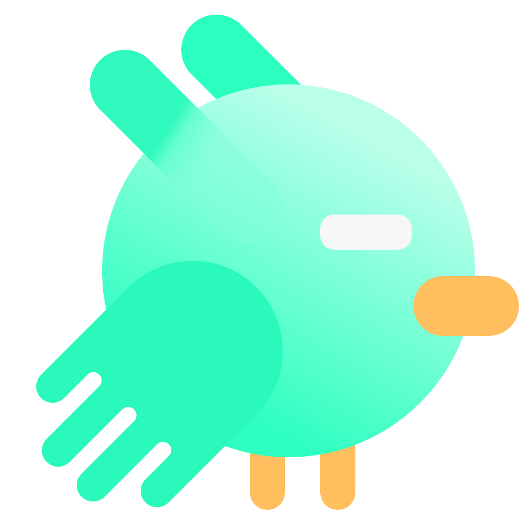 팀원소개

|              |                          |        |                |            |                                   |
| :--------------------------------------------------------------: | :--------------------------------------------------------------------------: | :--------------------------------------------------------: | :----------------------------------------------------------------: | :------------------------------------------------------------: | :-----------------------------------------------------------------------------------: |
|                              김혁진                              |                                    강민서                                    |                           서지흔                           |                                서희                                |                             김민채                             |                                        조원우                                         |
|                           Backend 팀장                           |                                   Backend                                    |                          Backend                           |                           Frontend 팀장                            |                            Frontend                            |                                       Frontend                                        |
| 기획, DB설계, Infra,<br> CI/CD, API 구현 <br>(포토 타임, 게시판) | 기획, DB설계, <br> Security 로그인, <br> 신분증 유사도 AI 구현,<br> API 구현 | 기획, DB설계,<br> 티켓팅 로직 구현,<br> API 구현, UCC 담당 | 기획, figma 작성,<br> 소셜 로그인 연동,<br> 화면 구현 및  API 연동 | 기획, figma 작성, <br> WebRTC 구현, <br> 화면 구현 및 API 연동 | 기획, 디자인 총괄, <br> 디자인 가이드 제작, <br> 화면 구현 및 API 연동, <br> 퍼블리싱 |
