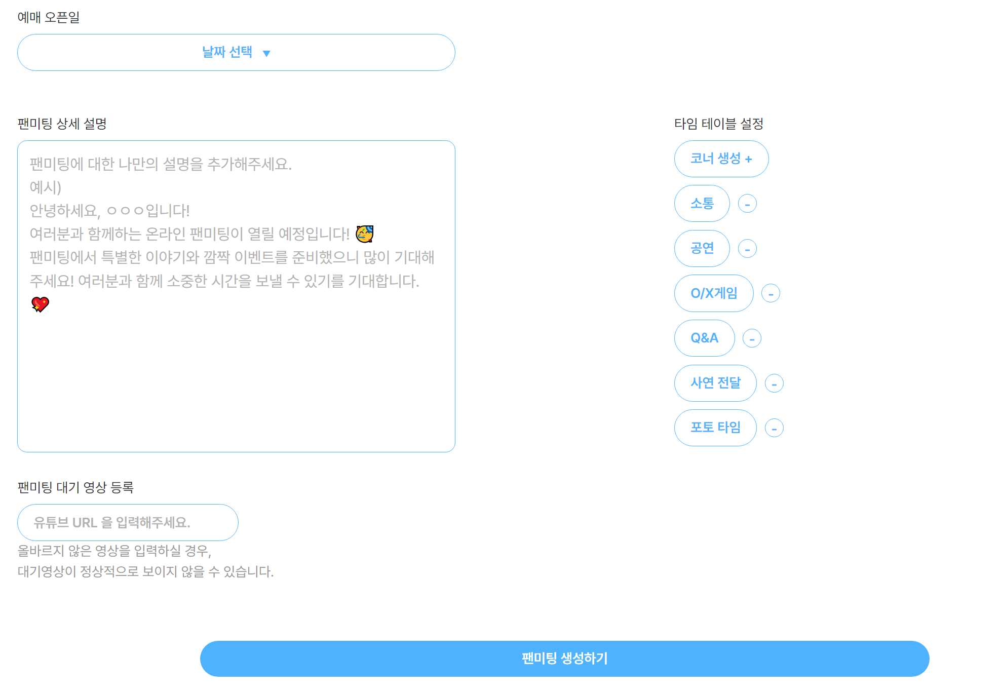

## 목차

[1. 프로젝트 소개](#1)
[2. 서비스 화면](#2)
[3. 프로젝트 산출물](#3)

<div id="1"></div>

#  프로젝트 소개

###  HiFive - 크리에이터와 팬의 하이파이브


크리에이터와 팬이 추억을 마주하는 웹기반 팬미팅 플랫폼

<br >

### 1. 로고


- 크리에이터와 팬이 손뼉을 마주하는 장면을 형상화
  - Primary : <span style="background-color: #FF6392; color: white;">#FF6392</span>
  - Secondary : <span style="background-color: #4FB2FF; color: white;">#4FB2FF</span>
- 서비스 이용자를 크리에이터와 팬으로 분리하여 고려
- 크리에이터만 접속 가능한 팬미팅 관리 페이지는 <span style="background-color: #4FB2FF; color: white;">Secondary</span> 로 표현하여 사용자가 관리 페이지임을 명확히 인식할 수 있도록 함

### 2. 서비스 목적


- 크리에이터 시장 규모가 급증했음에도 크리에이터와 팬을 위한 소통의 창구가 부족함
- 버츄얼 유튜버, 해외에 거주하는 유튜버 등 대면 팬미팅이 어려운 크리에이터도 팬과 소통을 즐길 수 있도록 함

### 3. 차별점



- 다양한 팬미팅 템플릿을 제공하여 간편하게 팬과의 특별한 추억을 남길 수 있음
  - **O/X 게임, Q&A, 사연 전달, 포토 타임 등 다양한 코너 템플릿 제공**
- 오프라인으로 진행하기 어려운 크리에이터를 위한 온라인 플랫폼 제공
- 소속사가 없는 영세 크리에이터도 쉽게 이용 가능
- 입장 전 **본인 확인 절차**를 통해 티켓 암표 거래 방지

### 4. 아키텍처


### 5. 기술스택

[](https://github.com/msdio/stackticon)

<div id="2"></div>

#  서비스 화면

|                                                               |                                                                 |
| ------------------------------------------------------------- | --------------------------------------------------------------- |
|          |            |
| ✨ 랜딩화면(서비스 소개 페이지)                               | 📌 메인화면                                                     |
|            |          |
| 🔑 카카오 로그인                                              | 🔍 프로필검색                                                   |
|              |            |
| 💚 크리에이터 프로필 조회                                     | 👶 마이페이지                                                   |
|  |              |
| 📖 사연, 질문 작성                                            | 👱‍♀️ 본인 확인                                                    |
|  |  |
| 🔊 [크리에이터] 크리에이터 프로필 작성, 수정, 삭제            | 📚 [크리에이터] 사연, 질문, OX게임 관리                         |
|      |    |
| 🔊 [크리에이터] 크리에이터 프로필 작성, 수정, 삭제            | 🎪 [크리에이터] 팬미팅 생성                                     |
| ㄴㅁㅇㅁㄴㅇ                                                  | ㄴㅁㅇㄴㅁㅇ                                                    |
| ㅁㄴㅇㄴㅁㅇ                                                  | ㅁㄴㅇㄴㅁㅇ                                                    |

<br/>

<div id="3"></div>

#  프로젝트 산출물

|                                                  |                                                       |
| ------------------------------------------------ | ----------------------------------------------------- |
|  |  |
| 📃 API 명세서(Swagger)                           | 🌞 요구사항정의서                                     |
|     |                                                       |
| 🎨 피그마                                        |

### 🔧 ERD


### 📂 프로젝트 구조

#### Backend

<details>
  <summary>펼치기 / 접기</summary>

```
📦main
 ┣ 📂java
 ┃ ┗ 📂com
 ┃ ┃ ┗ 📂ssafy
 ┃ ┃ ┃ ┗ 📂hifive
 ┃ ┃ ┃ ┃ ┣ 📂domain
 ┃ ┃ ┃ ┃ ┃ ┣ 📂auth
 ┃ ┃ ┃ ┃ ┃ ┃ ┣ 📂controller
 ┃ ┃ ┃ ┃ ┃ ┃ ┣ 📂dto
 ┃ ┃ ┃ ┃ ┃ ┃ ┃ ┣ 📂response
 ┃ ┃ ┃ ┃ ┃ ┃ ┣ 📂entity
 ┃ ┃ ┃ ┃ ┃ ┃ ┣ 📂repository
 ┃ ┃ ┃ ┃ ┃ ┃ ┗ 📂service
 ┃ ┃ ┃ ┃ ┃ ┣ 📂board
 ┃ ┃ ┃ ┃ ┃ ┃ ┣ 📂controller
 ┃ ┃ ┃ ┃ ┃ ┃ ┣ 📂dto
 ┃ ┃ ┃ ┃ ┃ ┃ ┃ ┣ 📂param
 ┃ ┃ ┃ ┃ ┃ ┃ ┃ ┣ 📂request
 ┃ ┃ ┃ ┃ ┃ ┃ ┃ ┗ 📂response
 ┃ ┃ ┃ ┃ ┃ ┃ ┣ 📂entity
 ┃ ┃ ┃ ┃ ┃ ┃ ┣ 📂repository
 ┃ ┃ ┃ ┃ ┃ ┃ ┗ 📂service
 ┃ ┃ ┃ ┃ ┃ ┣ 📂category
 ┃ ┃ ┃ ┃ ┃ ┃ ┣ 📂controller
 ┃ ┃ ┃ ┃ ┃ ┃ ┣ 📂dto
 ┃ ┃ ┃ ┃ ┃ ┃ ┃ ┗ 📂response
 ┃ ┃ ┃ ┃ ┃ ┃ ┣ 📂entity
 ┃ ┃ ┃ ┃ ┃ ┃ ┣ 📂repository
 ┃ ┃ ┃ ┃ ┃ ┃ ┗ 📂service
 ┃ ┃ ┃ ┃ ┃ ┣ 📂comment
 ┃ ┃ ┃ ┃ ┃ ┃ ┣ 📂controller
 ┃ ┃ ┃ ┃ ┃ ┃ ┣ 📂dto
 ┃ ┃ ┃ ┃ ┃ ┃ ┃ ┣ 📂param
 ┃ ┃ ┃ ┃ ┃ ┃ ┃ ┣ 📂request
 ┃ ┃ ┃ ┃ ┃ ┃ ┃ ┗ 📂response
 ┃ ┃ ┃ ┃ ┃ ┃ ┣ 📂entity
 ┃ ┃ ┃ ┃ ┃ ┃ ┣ 📂repository
 ┃ ┃ ┃ ┃ ┃ ┃ ┗ 📂service
 ┃ ┃ ┃ ┃ ┃ ┣ 📂creator
 ┃ ┃ ┃ ┃ ┃ ┃ ┣ 📂controller
 ┃ ┃ ┃ ┃ ┃ ┃ ┣ 📂dto
 ┃ ┃ ┃ ┃ ┃ ┃ ┃ ┣ 📂param
 ┃ ┃ ┃ ┃ ┃ ┃ ┃ ┣ 📂request
 ┃ ┃ ┃ ┃ ┃ ┃ ┃ ┗ 📂response
 ┃ ┃ ┃ ┃ ┃ ┃ ┣ 📂entity
 ┃ ┃ ┃ ┃ ┃ ┃ ┣ 📂repository
 ┃ ┃ ┃ ┃ ┃ ┃ ┗ 📂service
 ┃ ┃ ┃ ┃ ┃ ┣ 📂fanmeeting
 ┃ ┃ ┃ ┃ ┃ ┃ ┣ 📂controller
 ┃ ┃ ┃ ┃ ┃ ┃ ┣ 📂dto
 ┃ ┃ ┃ ┃ ┃ ┃ ┃ ┣ 📂param
 ┃ ┃ ┃ ┃ ┃ ┃ ┃ ┣ 📂request
 ┃ ┃ ┃ ┃ ┃ ┃ ┃ ┗ 📂response
 ┃ ┃ ┃ ┃ ┃ ┃ ┣ 📂entity
 ┃ ┃ ┃ ┃ ┃ ┃ ┣ 📂repository
 ┃ ┃ ┃ ┃ ┃ ┃ ┗ 📂service
 ┃ ┃ ┃ ┃ ┃ ┣ 📂follow
 ┃ ┃ ┃ ┃ ┃ ┃ ┣ 📂controller
 ┃ ┃ ┃ ┃ ┃ ┃ ┣ 📂entity
 ┃ ┃ ┃ ┃ ┃ ┃ ┣ 📂repository
 ┃ ┃ ┃ ┃ ┃ ┃ ┗ 📂service
 ┃ ┃ ┃ ┃ ┃ ┣ 📂member
 ┃ ┃ ┃ ┃ ┃ ┃ ┣ 📂controller
 ┃ ┃ ┃ ┃ ┃ ┃ ┣ 📂dto
 ┃ ┃ ┃ ┃ ┃ ┃ ┃ ┣ 📂request
 ┃ ┃ ┃ ┃ ┃ ┃ ┃ ┗ 📂response
 ┃ ┃ ┃ ┃ ┃ ┃ ┣ 📂entity
 ┃ ┃ ┃ ┃ ┃ ┃ ┣ 📂repository
 ┃ ┃ ┃ ┃ ┃ ┃ ┗ 📂service
 ┃ ┃ ┃ ┃ ┃ ┣ 📂openvidu
 ┃ ┃ ┃ ┃ ┃ ┃ ┣ 📂controller
 ┃ ┃ ┃ ┃ ┃ ┃ ┣ 📂dto
 ┃ ┃ ┃ ┃ ┃ ┃ ┃ ┣ 📂request
 ┃ ┃ ┃ ┃ ┃ ┃ ┃ ┗ 📂response
 ┃ ┃ ┃ ┃ ┃ ┃ ┗ 📂service
 ┃ ┃ ┃ ┃ ┃ ┣ 📂photo
 ┃ ┃ ┃ ┃ ┃ ┃ ┣ 📂controller
 ┃ ┃ ┃ ┃ ┃ ┃ ┣ 📂dto
 ┃ ┃ ┃ ┃ ┃ ┃ ┃ ┣ 📂param
 ┃ ┃ ┃ ┃ ┃ ┃ ┃ ┗ 📂response
 ┃ ┃ ┃ ┃ ┃ ┃ ┣ 📂entity
 ┃ ┃ ┃ ┃ ┃ ┃ ┣ 📂repository
 ┃ ┃ ┃ ┃ ┃ ┃ ┗ 📂service
 ┃ ┃ ┃ ┃ ┃ ┣ 📂point
 ┃ ┃ ┃ ┃ ┃ ┃ ┣ 📂controller
 ┃ ┃ ┃ ┃ ┃ ┃ ┣ 📂dto
 ┃ ┃ ┃ ┃ ┃ ┃ ┃ ┣ 📂param
 ┃ ┃ ┃ ┃ ┃ ┃ ┃ ┣ 📂request
 ┃ ┃ ┃ ┃ ┃ ┃ ┃ ┣ 📂response
 ┃ ┃ ┃ ┃ ┃ ┃ ┣ 📂entity
 ┃ ┃ ┃ ┃ ┃ ┃ ┣ 📂repository
 ┃ ┃ ┃ ┃ ┃ ┃ ┗ 📂service
 ┃ ┃ ┃ ┃ ┃ ┣ 📂question
 ┃ ┃ ┃ ┃ ┃ ┃ ┣ 📂controller
 ┃ ┃ ┃ ┃ ┃ ┃ ┣ 📂dto
 ┃ ┃ ┃ ┃ ┃ ┃ ┃ ┣ 📂param
 ┃ ┃ ┃ ┃ ┃ ┃ ┃ ┣ 📂request
 ┃ ┃ ┃ ┃ ┃ ┃ ┃ ┗ 📂response
 ┃ ┃ ┃ ┃ ┃ ┃ ┣ 📂entity
 ┃ ┃ ┃ ┃ ┃ ┃ ┣ 📂repository
 ┃ ┃ ┃ ┃ ┃ ┃ ┗ 📂service
 ┃ ┃ ┃ ┃ ┃ ┣ 📂quiz
 ┃ ┃ ┃ ┃ ┃ ┃ ┣ 📂controller
 ┃ ┃ ┃ ┃ ┃ ┃ ┣ 📂dto
 ┃ ┃ ┃ ┃ ┃ ┃ ┃ ┣ 📂request
 ┃ ┃ ┃ ┃ ┃ ┃ ┃ ┗ 📂response
 ┃ ┃ ┃ ┃ ┃ ┃ ┣ 📂entity
 ┃ ┃ ┃ ┃ ┃ ┃ ┣ 📂repository
 ┃ ┃ ┃ ┃ ┃ ┃ ┗ 📂service
 ┃ ┃ ┃ ┃ ┃ ┣ 📂reservation
 ┃ ┃ ┃ ┃ ┃ ┃ ┣ 📂controller
 ┃ ┃ ┃ ┃ ┃ ┃ ┣ 📂dto
 ┃ ┃ ┃ ┃ ┃ ┃ ┃ ┗ 📂response
 ┃ ┃ ┃ ┃ ┃ ┃ ┣ 📂entity
 ┃ ┃ ┃ ┃ ┃ ┃ ┣ 📂repository
 ┃ ┃ ┃ ┃ ┃ ┃ ┗ 📂service
 ┃ ┃ ┃ ┃ ┃ ┣ 📂s3
 ┃ ┃ ┃ ┃ ┃ ┃ ┣ 📂controller
 ┃ ┃ ┃ ┃ ┃ ┃ ┣ 📂dto
 ┃ ┃ ┃ ┃ ┃ ┃ ┃ ┣ 📂request
 ┃ ┃ ┃ ┃ ┃ ┃ ┃ ┗ 📂response
 ┃ ┃ ┃ ┃ ┃ ┃ ┗ 📂service
 ┃ ┃ ┃ ┃ ┃ ┣ 📂story
 ┃ ┃ ┃ ┃ ┃ ┃ ┣ 📂controller
 ┃ ┃ ┃ ┃ ┃ ┃ ┣ 📂dto
 ┃ ┃ ┃ ┃ ┃ ┃ ┃ ┣ 📂param
 ┃ ┃ ┃ ┃ ┃ ┃ ┃ ┣ 📂request
 ┃ ┃ ┃ ┃ ┃ ┃ ┃ ┗ 📂response
 ┃ ┃ ┃ ┃ ┃ ┃ ┣ 📂entity
 ┃ ┃ ┃ ┃ ┃ ┃ ┣ 📂repository
 ┃ ┃ ┃ ┃ ┃ ┃ ┗ 📂service
 ┃ ┃ ┃ ┃ ┃ ┗ 📂timetable
 ┃ ┃ ┃ ┃ ┃ ┃ ┣ 📂controller
 ┃ ┃ ┃ ┃ ┃ ┃ ┣ 📂dto
 ┃ ┃ ┃ ┃ ┃ ┃ ┃ ┣ 📂request
 ┃ ┃ ┃ ┃ ┃ ┃ ┃ ┣ 📂response
 ┃ ┃ ┃ ┃ ┃ ┃ ┣ 📂entity
 ┃ ┃ ┃ ┃ ┃ ┃ ┣ 📂repository
 ┃ ┃ ┃ ┃ ┃ ┃ ┗ 📂service
 ┃ ┃ ┃ ┃ ┣ 📂global
 ┃ ┃ ┃ ┃ ┃ ┣ 📂config
 ┃ ┃ ┃ ┃ ┃ ┃ ┣ 📂jwt
 ┃ ┃ ┃ ┃ ┃ ┃ ┣ 📂oauth
 ┃ ┃ ┃ ┃ ┃ ┃ ┣ 📂redis
 ┃ ┃ ┃ ┃ ┃ ┃ ┣ 📂s3
 ┃ ┃ ┃ ┃ ┃ ┃ ┣ 📂websocket
 ┃ ┃ ┃ ┃ ┃ ┣ 📂entity
 ┃ ┃ ┃ ┃ ┃ ┣ 📂error
 ┃ ┃ ┃ ┃ ┃ ┃ ┣ 📂response
 ┃ ┃ ┃ ┃ ┃ ┃ ┣ 📂type
 ┃ ┃ ┃ ┃ ┃ ┣ 📂exception
 ┃ ┃ ┃ ┃ ┃ ┣ 📂infra
 ┃ ┃ ┃ ┃ ┃ ┗ 📂util
 ┗ 📂resources
 ┃ ┣ 📂static
 ┃ ┣ 📂templates
```

</details>

#### Frontend

<details>
  <summary>펼치기 / 접기</summary>

```
📦src
 ┣ 📂assets
 ┃ ┣ 📂Fanmeeting
 ┃ ┣ 📂icons
 ┃ ┃ ┣ 📂loading
 ┃ ┃ ┣ 📂logo
 ┃ ┃ ┣ 📂sidebar
 ┃ ┣ 📂img
 ┃ ┣ 📂joinCreator
 ┃ ┗ 📂temp
 ┣ 📂components
 ┃ ┣ 📂Navbar
 ┣ 📂pages
 ┃ ┣ 📂BoardPage
 ┃ ┣ 📂CreatorListPage
 ┃ ┣ 📂CreatorOnly
 ┃ ┣ 📂FanmeetingPage
 ┃ ┣ 📂JoinCreatorPage
 ┃ ┣ 📂LandingPage
 ┃ ┣ 📂MainPage
 ┃ ┣ 📂Mypage
 ┃ ┣ 📂ProfilePage
 ┃ ┣ 📂TicketPage
 ┣ 📂service
 ┣ 📂store
 ┣ 📂utils

```

</details>

#  팀원소개

|  |  |  |  |  |  |
| :--------------------------------------------------: | :--------------------------------------------------: | :--------------------------------------------------: | :--------------------------------------------------: | :--------------------------------------------------: | :--------------------------------------------------: |
|                        김혁진                        |                        강민서                        |                        서지흔                        |                         서희                         |                        김민채                        |                        조원우                        |
|                     Backend 팀장                     |                       Backend                        |                       Backend                        |                    Frontend 팀장                     |                       Frontend                       |                       Frontend                       |
|        인프라, CI/CD, DB 및 API 설계 및 구현         |                   API 설계 및 구현                   |                   API 설계 및 구현                   |                        UI/UX                         |                        UI/UX                         |                        UI/UX                         |
