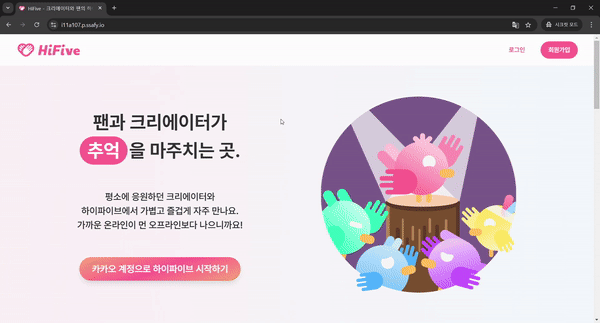
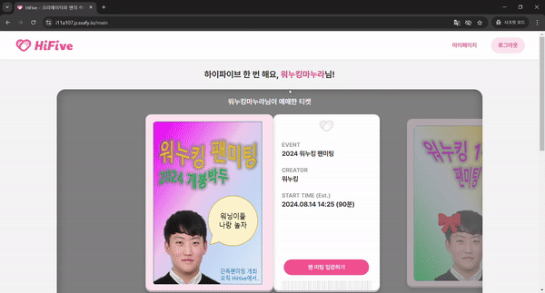
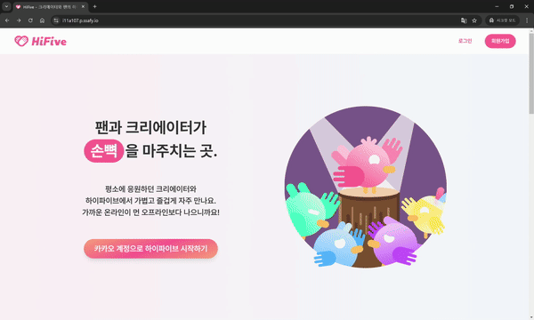
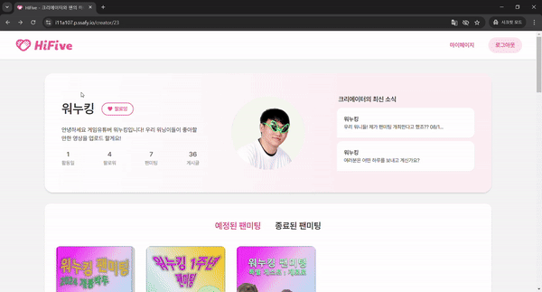
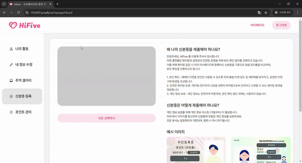
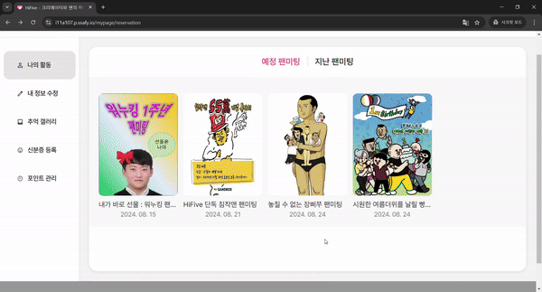
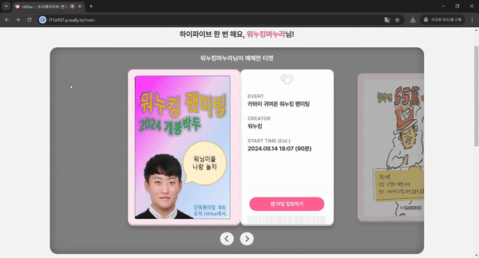
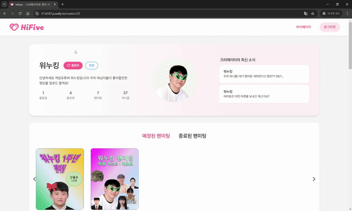
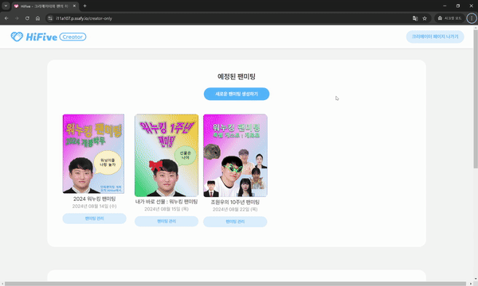
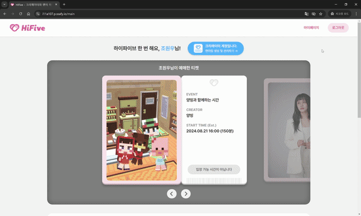

# 시연 시나리오

> 시연 순서에 따른 site 화면별, 실행별(클릭 위치 등) 상세 설명

---

## 목차

[1. 랜딩 화면](#1)
[2. 메인 화면](#2)
[3. 카카오 로그인](#3)
[4. 크리에이터 프로필 조회](#4)
[5. 마이페이지](#5)
[6. 프로필 검색](#6)
[7. 사연, 질문 작성](#7)
[8. 본인 확인](#8)
[9. [크리에이터] 크리에이터 프로필 작성, 수정, 삭제](#9)
[10. [크리에이터] 사연, 질문, OX게임 관리](#10)
[11. [크리에이터] 팬미팅 생성](#11)

---

## 팬 시점

### ✨ 랜딩화면(서비스 소개 페이지)

- HiFive 를 처음 접하는 사용자들도 어떤 서비스인지 알 수 있도록 간단히 서비스를 소개함
- 입점한 크리에이터를 소개함

### 📌 메인화면

- 내가 예매한 티켓을 바로 확인할 수 있어 사용자 편의 증가
  - 예매한 팬미팅을 티켓 형식으로 디자인
  - 팬미팅 시작 30분 전부터 입장 버튼 활성화
- 본인이 팔로우한 크리에이터를 모아볼 수 있다.
  - 전체 크리에이터 보기를 통해 전체 크리에이터 목록으로 이동할 수 있음
- 예매 가능한 팬미팅 찾아보기 버튼
  - 전체 팬미팅 목록으로 이동한다.
- 나의 팬미팅 내역 보러가기 버튼
  - 나의 활동으로 이동하여 나와 관련된 각종 정보를 확인할 수 있다.

 

### 🔑 카카오 로그인

- 사용자들의 접근성과 편의성을 높이기 위해 카카오 로그인으로 진행
- 초기 닉네임은 본인 카카오톡 이름이지만, 추후 닉네임 변경 가능하다.

 

### 💚 크리에이터 프로필 조회

### 👶 마이페이지

- 팬은 상단 네비게이션 바에 있는 마이 페이지 버튼 또는 나의 활동 보러가기 버튼을 통해 마이페이지로 이동할 수 있다.

1. 나의 활동 탭
   - 내가 예매한 팬미팅 관련 정보를 볼 수 있다. (예매한 팬미팅, 종료한 팬미팅)
2. 내 정보 수정 탭
   - 닉네임과 프로필 사진을 변경할 수 있다.
   - 닉네임은 중복 검색을 진행하여 중복될 경우 해당 닉네임을 사용할 수 없다.
3. 추억 갤러리 탭
   - 과거에 참여했던 팬미팅에서 찍은 사진이 저장된다.
   - 사진 찍는 순간을 영상으로 캡쳐해서 언제든지 추억할 수 있다.
4. 신분증 등록 탭
   - 팬미팅 시작 전 본인인증에 이용할 신분증을 등록한다.
   - 신분증 등록 관련 안내 문구가 우측에 출력된다.
   - 신분증은 계정 양도 문제로 인해 한 번 등록하면 변경할 수 없다.
5. 포인트 관리 탭
   - 팬미팅 예매에 사용할 포인트를 충전할 수 있다.
   - 충전 내역 조회에서 본인이 충전한 내용을 한 눈에 볼 수 있다.
   - 사용 내역 조회에서 본인이 사용한 포인트를 조회할 수 있다.

### 🔍 프로필검색

- Elastic Search 를 이용하여 사용자들이 쉽게 원하는 크리에이터를 검색할 수 있게 함
- 목록은 가나다순, 최신순, 활동일순으로 정렬할 수 있다.
  - 목록 출력은 성능 개선을 위해 무한 스크롤로 구현
  - 스크롤 이벤트를 감지하여 추가적인 api 를 호출하고 목록을 받아온다.
- 선택한 크리에이터의 프로필을 클릭하면 해당 크리에이터의 프로필 페이지로 이동한다.

 

### 📖 사연, 질문 작성

### 📖 본인 확인

- 등록된 신분증과 웹캠 이미지 유사도 확인

---

## 크리에이터 시점

### 🔊 [크리에이터] 크리에이터 프로필 작성, 수정, 삭제

- 유저는 크리에이터 프로필 페이지에서 팬미팅에 관련한 정보를 얻을 수 있다.
- 예정 팬미팅, 종료 팬미팅을 한눈에 확인할 수 있음
- 크리에이터가 팬들에 쓰는 게시판이 있어 팬미팅 관련 정보를 친근하게 전달할 수 있다.

 

### 📚 [크리에이터] 사연, 질문, OX게임 관리

### 🎪 [크리에이터] 팬미팅 생성

