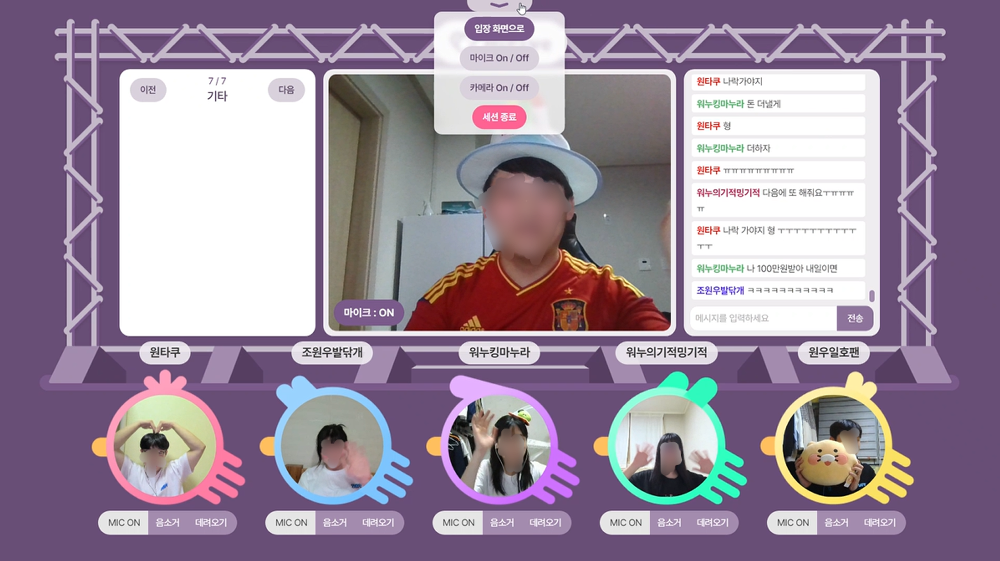
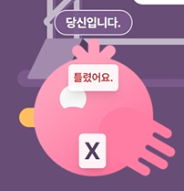

# 시연 시나리오

> 시연 순서에 따른 site 화면별, 실행별(클릭 위치 등) 상세 설명

---

## 목차

[1. 랜딩 화면](#1)
[2. 메인 화면](#2)
[3. 카카오 로그인](#3)
[4. 크리에이터 프로필 조회](#4)
[5. 마이페이지](#5)
[6. 프로필 검색](#6)
[7. 사연, 질문 작성](#7)
[8. 본인 확인](#8)
[9. 팬미팅 입장](#9)
[10. 소통, OX게임, 포토타임 등 팬미팅 세션](#10)
[11. 팬미팅 엔딩](#11)
[12. [크리에이터] 크리에이터 프로필 작성, 수정, 삭제](#12)
[13. [크리에이터] 사연, 질문, OX게임 관리](#13)
[14. [크리에이터] 팬미팅 생성](#14)
[15. [크리에이터] 팬미팅 진행](#15)
[16. 팬미팅 버튼 설명](#16)

---

## 팬 시점

### ✨ 랜딩화면(서비스 소개 페이지)

- HiFive 를 처음 접하는 사용자들도 어떤 서비스인지 알 수 있도록 간단히 서비스를 소개함
- 입점한 크리에이터를 소개함

### 📌 메인화면

- 내가 예매한 티켓을 바로 확인할 수 있어 사용자 편의 증가
  - 예매한 팬미팅을 티켓 형식으로 디자인
  - 팬미팅 시작 30분 전부터 입장 버튼 활성화
- 본인이 팔로우한 크리에이터를 모아볼 수 있다.
  - 전체 크리에이터 보기를 통해 전체 크리에이터 목록으로 이동할 수 있음
- 예매 가능한 팬미팅 찾아보기 버튼
  - 전체 팬미팅 목록으로 이동한다.
- 나의 팬미팅 내역 보러가기 버튼
  - 나의 활동으로 이동하여 나와 관련된 각종 정보를 확인할 수 있다.

 

### 🔑 카카오 로그인

- 사용자들의 접근성과 편의성을 높이기 위해 카카오 로그인으로 진행
- 초기 닉네임은 본인 카카오톡 이름이지만, 추후 닉네임 변경 가능하다.

 

### 💚 크리에이터 프로필 조회

- 크리에이터의 프로필은 크게 3구역(크리에이터 정보, 팬미팅 정보, 게시글)로 구분되어 있다.

1. 크리에이터 정보
   - 활동명, 소개글, 활동일, 팔로워 수, HiFive에서 진행한 팬미팅 수, 게시글 수, 프로필 이미지, 최신에 작성한 게시글 2개의 정보들이 표시된다.
   - '팔로우' 버튼을 클릭하면 해당 크리에이터를 팔로우할 수 있으며, 기존 '팔로우' 버튼은 '팔로잉' 버튼으로 변경된다.
   - '팔로잉' 버튼을 클릭하면 해당 크리에이터를 언팔로우할 수 있으며, 기존 '팔로잉' 버튼은 '팔로우' 버튼으로 변경된다.
   - 크리에이터 프로필 이미지를 클릭하면 해당 크리에이터의 채널로 이동할 수 있다.
2. 팬미팅 정보
   - 예정된 팬미팅과 종료된 팬미팅으로 구분하여 해당 크리에이터의 팬미팅 정보를 확인할 수 있다.
   - 팬미팅 정보를 클릭하면 해당 팬미팅의 상세보기 페이지로 이동한다.
3. 게시글
   - 크리에이터가 작성한 게시글을 확인할 수 있다.
   - '자세히 보기' 버튼을 클릭하면 해당 게시글 페이지로 이동되며 댓글을 작성하고 확인할 수 있다.

### 👶 마이페이지

- 팬은 상단 네비게이션 바에 있는 마이 페이지 버튼 또는 나의 활동 보러가기 버튼을 통해 마이페이지로 이동할 수 있다.

1. 나의 활동 탭
   - 내가 예매한 팬미팅 관련 정보를 볼 수 있다. (예매한 팬미팅, 종료한 팬미팅)
2. 내 정보 수정 탭
   - 닉네임과 프로필 사진을 변경할 수 있다.
   - 닉네임은 중복 검색을 진행하여 중복될 경우 해당 닉네임을 사용할 수 없다.
3. 추억 갤러리 탭
   - 과거에 참여했던 팬미팅에서 찍은 사진이 저장된다.
   - 사진 찍는 순간을 영상으로 캡쳐해서 언제든지 추억할 수 있다.
4. 신분증 등록 탭
   - 팬미팅 시작 전 본인인증에 이용할 신분증을 등록한다.
   - 신분증 등록 관련 안내 문구가 우측에 출력된다.
   - 신분증은 계정 양도 문제로 인해 한 번 등록하면 변경할 수 없다.
5. 포인트 관리 탭
   - 팬미팅 예매에 사용할 포인트를 충전할 수 있다.
   - 충전 내역 조회에서 본인이 충전한 내용을 한 눈에 볼 수 있다.
   - 사용 내역 조회에서 본인이 사용한 포인트를 조회할 수 있다.

### 🔍 프로필검색

- Elastic Search 를 이용하여 사용자들이 쉽게 원하는 크리에이터를 검색할 수 있게 함
- 목록은 가나다순, 최신순, 활동일순으로 정렬할 수 있다.
  - 목록 출력은 성능 개선을 위해 무한 스크롤로 구현
  - 스크롤 이벤트를 감지하여 추가적인 api 를 호출하고 목록을 받아온다.
- 선택한 크리에이터의 프로필을 클릭하면 해당 크리에이터의 프로필 페이지로 이동한다.

 

### 📖 사연, 질문 작성

- 팬은 예매한 팬미팅에서 크리에이터에게 전달 할 사연, 질문을 작성할 수 있다.
- 사연
  - 제목 및 내용(255자 이내) 작성하여 등록 후 수정 및 삭제를 할 수 있다.
- 질문
  - 최대 6개의 질문의 내용(최대 100자)을 작성하여 등록 후 수정 및 삭제를 할 수 있다.

### 👱‍♀️ 본인 확인

- 등록된 신분증과 웹캠 이미지 유사도 확인

- 팬미팅 입장하기는 팬미팅 시작 30분 전에 활성화 된다.
- 팬은 팬미팅 입장하기 버튼을 누르면 본인 확인 절차를 진행한다.
  - 신분증 미등록시 먼저 신분증을 등록하라는 메시지가 뜨고 입장이 불가능하다.
  - 등록 된 신분증과 본인 웹캠 얼굴 유사도를 측정하여 본인이라고 판단이 되면 넘어간다.
  - 신분증 사진과 본인 웹캠 얼굴이 다르다면 입장이 불가능하다.

### 🚪 팬미팅 입장

- 팬은 팬미팅 입장하기 버튼을 누르면 대기화면으로 이동한다.
- 크리에이터가 팬미팅을 시작하면 자동으로 팬미팅 화면으로 이동한다.

### 🌞 소통, OX게임, 포토타임 등 팬미팅 세션

|                                                  |                                                |
| ------------------------------------------------ | ---------------------------------------------- |
|  |    |
| 👨‍👩‍👧‍👦 포토타임 세션                                 | 👂 소통 세션                                   |
|       |  |
| ❓ QnA 세션                                      | 🎮 OX게임 세션                                 |
|      |    |
| 🎶 공연 세션                                     | 💌 사연 세션                                   |

- 팬은 크리에이터가 준비한 카테고리를 즐길 수 있다.
- 채팅을 치면 각 팬 별로 닉네임 및 색이 다르게 표시된다.
- 팬은 자신의 화면을 직접 끄고 킬 수 있다.
- 마이크 권한은 크리에이터에게 있다.

### 🌙 팬미팅 엔딩

- 크리에이터가 팬미팅을 종료하면 팬은 result화면으로 나온다.
- 포토타임에서 찍었던 사진을 추억 갤러리에서 실시간으로 확인이 가능하다.

---

## 크리에이터 시점

### 🔊 [크리에이터] 크리에이터 프로필 작성, 수정, 삭제

- 크리에이터는 자신의 크리에이터 프로필 페이지에서만 아래 기능을 추가로 수행할 수 있다.
- '편집' 버튼을 클릭하여 프로필 이미지, 소개글, 채널링크를 수정할 수 있다.
- 게시글을 작성할 수 있다.
- '게시글 상세보기' 버튼을 클릭하여 작성한 게시글을 수정하고 삭제할 수 있다.

 

### 📚 [크리에이터] 사연, 질문, OX게임 관리

- 크리에이터는 각 팬미팅 관리 페이지에 접속하여 해당 팬미팅에서 사용할 사연, 질문(Q&A), ox게임을 설정할 수 있다.

1. Q&A 관리
   - 팬들이 작성한 모든 Q&A를 확인할 수 있다.
   - 전체 질문, 선택한 질문, 미선택한 질문으로 탭이 구분되어 있다.
   - '질문 선택' 버튼을 클릭하면 해당 질문이 선택한 질문으로 변경되며, 선택한 질문은 팬미팅에서 소개된다.
2. 사연 관리
   - 팬들이 작성한 모든 사연을 확인할 수 있다.
   - 전체 사연, 선택한 사연, 미선택한 사연으로 탭이 구분되어 있다.
   - 표 형식으로 사연 제목과 선택 여부가 나타나며, 게시글을 클릭하면 해당 사연 상세보기 페이지로 이동한다.
   - '사연 선택하기' 버튼을 클릭하면 해당 사연이 선택한 선택으로 변경되며, 선택한 사연은 팬미팅에서 소개된다.
3. ox게임 관리
   - 팬미팅에서 사용할 ox게임을 등록할 수 있다.
   - '퀴즈 생성하기' 버튼을 클릭한 후 질문, 정답, 설명을 작성하고 '문제 등록하기' 버튼을 클릭하면 문제가 등록된다.
   - 등록한 문제는 '수정하기' 버튼을 사용하여 정답을 수정할 수 있다.
   - 등록한 모든 문제는 팬미팅에서 표시되며, '삭제하기' 버튼을 사용하여 등록한 문제를 삭제할 수 있다.

### 🎪 [크리에이터] 팬미팅 생성

- 크리에이터는 새로운 팬미팅을 생성할 수 있다.
- 팬미팅 생성 페이지에 표시된 모든 정보를 설정해야만 팬미팅을 생성할 수 있다.
- 팬미팅 제목은 최대 30자까지 입력 가능하다.
- 팬미팅 행사 날짜는 최소 일주일 후부터 설정할 수 있다. (팬미팅 등록후 티켓팅, 사연, 질문, ox게임 등 준비할 시간이 필요하므로)
- 티켓 오픈일은 팬미팅 생성 다음날부터 팬미팅 시작 하루 전 날 중에 선택할 수 있다.
- 팬미팅 생성시 팬미팅 진행 순서에 맞게 타임 테이블을 작성해야 한다.
- '코너 생성' 버튼을 클릭하여 코너를 추가할 수 있으며, 기본으로 제공하는 코너는 '소통, 공연, 포토 타임, Q&A, 사연 전달, O/X 게임' 이다.
- 코너 생성시 '직접 입력'을 클릭하면 자신만의 특별한 코너를 생성할 수 있다.
- 코너의 순서를 변경하고 싶을 시에는 코너를 클릭한 상태로 움직이면 순서를 변경할 수 있다.
- '-' 버튼을 클릭하면 해당 코너를 타임 테이블에서 제거할 수 있다.

### 🚪 [크리에이터] 팬미팅 진행

- 크리에이터는 대기화면에서 팬미팅 시작을 통해 팬미팅을 시작할 수 있다.

- 팬의 마이크를 음소거 또는 활성화시킬 수 있다.

- 다음 또는 이전 버튼을 통해 카테고리를 이동할 수 있다.
- 데려오기, 돌려놓기를 통해 팬의 화면을 이동시킬 수 있다.
- 각 카테고리 별로 버튼을 활용해 액션을 취할 수 있다.
- 세션 종료를 통해 팬미팅을 종료할 수 있다.

---

## 팬미팅 버튼 설명

- 화면 위 화살표 버튼을 클릭하면 팬미팅 관련 리모컨을 확인할 수 있다.
  - 입장 화면, 마이크 on/off, 카메라 on/off, 세션 종료 등을 진행할 수 있다.

- 크리에이터가 데려오기를 클릭하면 팬을 무대 위로 올려 소통할 수 있다.

- 카메라 ON/OFF를 진행하면 카메라가 가려지고 이미지와 같이 변경된다.
