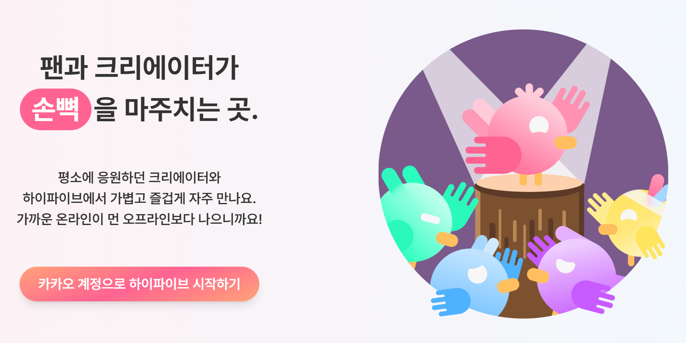

# 프로젝트 소개

### **HiFive - 크리에이터와 팬의 하이파이브**

크리에이터와 팬이 추억을 마주하는 웹기반 팬미팅 플랫폼

 

1. 로고
   

   - 크리에이터와 팬이 손뼉을 마주하는 장면을 형상화
     - Primary : #FF6392
     - Secondary : #4FB2FF
   - 서비스 이용자를 크리에이터와 팬으로 분리하여 고려
   - 크리에이터만 접속 가능한 팬미팅 관리 페이지는 Secondary 로 표현하여 사용자가 관리 페이지임을 명확히 인식할 수 있도록 함

2. 서비스 목적
   

   - 크리에이터 시장 규모가 급증했음에도 크리에이터와 팬을 위한 소통의 창구가 부족함
   - 버츄얼 유튜버, 해외에 거주하는 유튜버 등 대면 팬미팅이 어려운 크리에이터도 팬과 소통을 즐길 수 있도록 함

3. 차별점
   
   - 다양한 팬미팅 템플릿을 제공하여 간편하게 팬과의 특별한 추억을 남길 수 있음
     - **O/X 게임, Q&A, 사연 전달, 포토 타임 등 다양한 코너 템플릿 제공**
   - 오프라인으로 진행하기 어려운 크리에이터를 위한 온라인 플랫폼 제공
   - 소속사가 없는 영세 크리에이터도 쉽게 이용 가능
   - 입장 전 **본인 확인 절차**를 통해 티켓 암표 거래 방지
